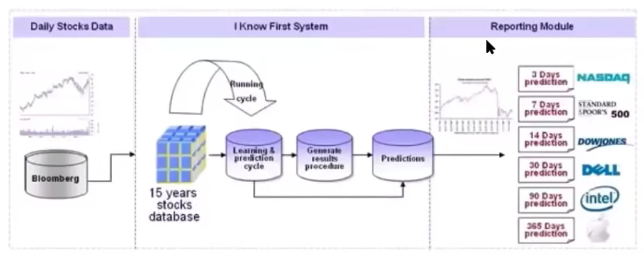

# OutLine
- deep inside looks in us stock models
- problems and bottlenecks
- RNN
- LSTM
- GRU
- Reinforcement Learning

## 这种模型无用-传统模型方法

1. 数据输入的是垃圾
2. 大公司噪音比较低, 比较稳定,所以MS的无用

## Stock Market运行模型究竟是什么?
- 归纳: 归纳策略
- 演绎
- 博弈:涉及一个优秀的策略, 至关重要

股票受市场宏观系统影响, 其本身的变量因子非常复杂多变, 不同因子之间内在逻辑不断变化.同时作为股票市场的参与者,本身就是一种非理性input,不管是跟风炒股的韭菜还是干预市场的政府.

交易系统鲁棒性:
拟合结果之间两难选择:

你赚的是谁的钱??
你需要了解整个市场上的参与者思想,不断调整动态策略本身

LSTM
- nput gate
- forget gate
- output gate

