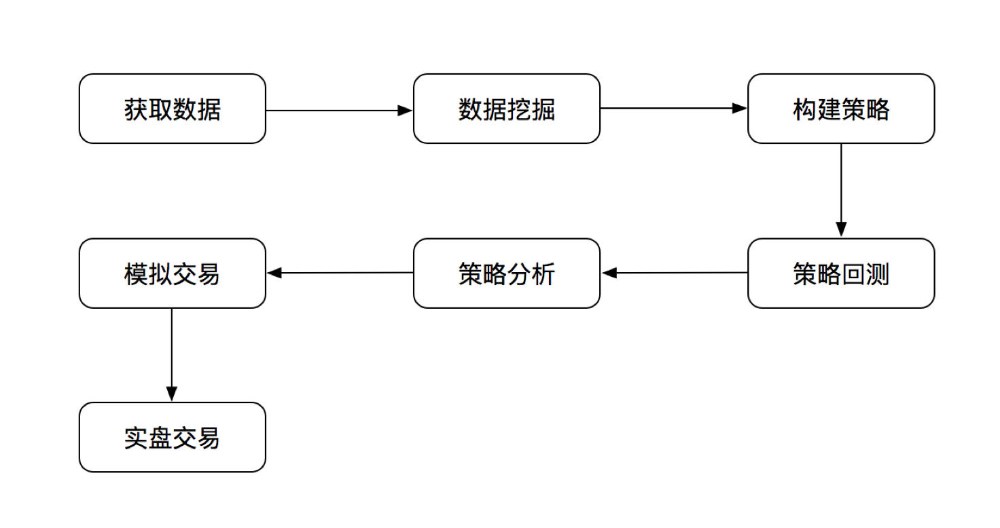
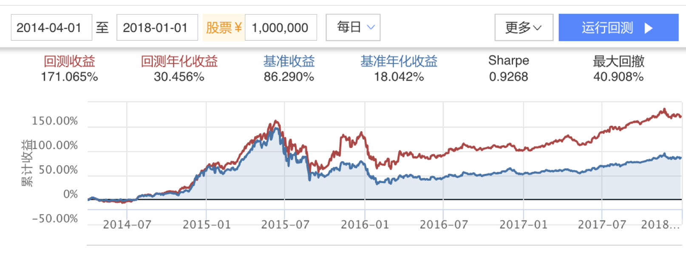
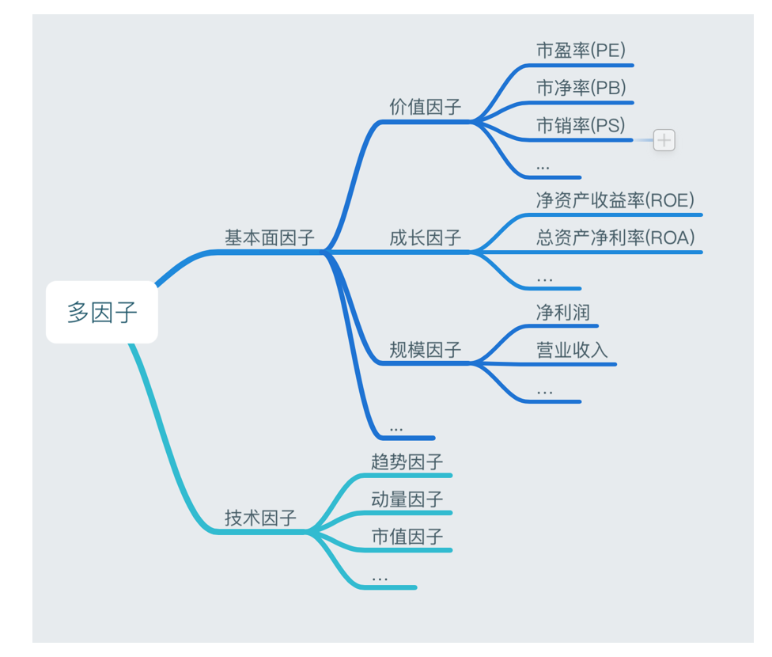
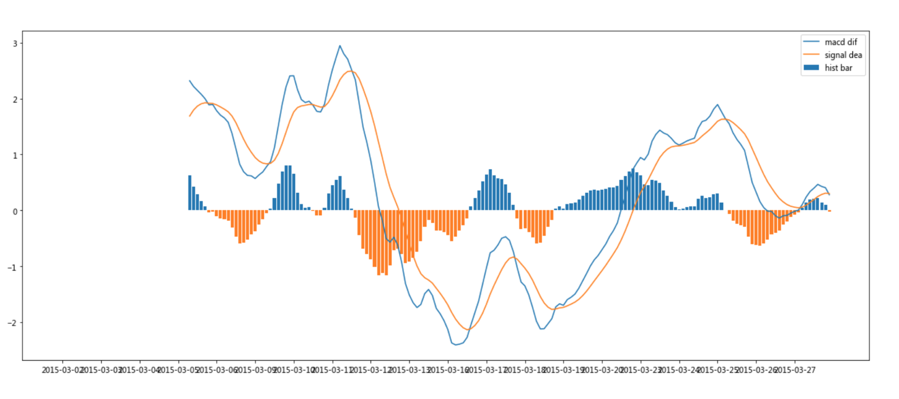

## 0 资源

#### 国内在线量化平台
+ [BigQuant](https://bigquant.com/)
+ [优矿](https://uqer.io/)
+ [Ricequant](https://www.ricequant.com/welcome/)
+ [量化](https://www.myquant.cn/)

#### 国外量化平台
+ [Quantopian](https://www.quantopian.com/)
+ [Quantstart](https://www.quantstart.com/)

#### 开源框架
+ Pandas - 数据分析包
+ Zipline - 一个Python的回测框架
+ vnpy - 基于python的开源交易平台开发框架
+ tushare - 财经数据接口包
+ easytrader - 进行自动的程序化股票交易
+ pyalgotrade - 一个Python的事件驱动回测框架
+ pyalgotrade-cn -整合了tushare提供实时行情。
+ zwPython - 集成式python开发平台
+ quantmod - 量化金融建模
+ rqalpha - 基于Python的回测引擎
+ quantdigger - 基于python的量化回测框架

### 学习流程
+ Python基础知识
+ 金融量化常用库学习（如：Numpy、Pandas、Scipy、Matplotlib等）
+ 爬虫基本知识+财经网站数据开源库（如：baostock、Scrapy、tushare等）
+ 文本分析（NLP处理、词云分析、jieba分词）
+ 机器学习（sklearn）
+ 深度学习（TensorFlow）

## 1、 量化交易介绍

**股票的量化投资** 可以说是一种价值投资，我们所做的也是去挖掘市场中的价值股票，而并非去预测股票涨跌来进行投资等等（至少目前机构不会采取这种方式指导投资），这需要大家明确的一个问题。

量化回测框架提供**完整的数据**，以及**回测机制进行策略评估研究**，并能够实时进行模拟交易。为实盘交易提供选择。

用数学模型，而不是人脑，决定交易的品种、方向、时机、数量。

- 数学模型可以复杂，也可以简单
- 可以是自动交易，也可以不自动交易
- 有价格曲线的品种，都能量化交易
- 交易玩法众多

<!--more-->

### 1.1流程包含的内容

- 获取数据：
  - 公司财务、新闻数据
  - 基本行情数据
- 数据分析挖掘：
  - 数据处理，标准化，去极值，中性化分组回测，行业分布
- 构建策略:
  - 多因子策略
- 回测、策略分析:
  - 评估分析策略可行性
- 模拟交易:
  - 接入实时行情，实时获取成交回报
  - 实时监控，实时归因分析
- 实盘交易:
  - 接入真实券商账户
  
另一个流程别人写的描述:
#### 交易流程

- 构建策略(数学模型)
- 回测(用历史数据去验证策略的效果)
- 实盘测试(用资金去跑)
- 实盘

### 1.2 分析结果

我们最终想要的结果就是在回测当中表现的较好的分析方法和策略。比如：

## 2、回测框架介绍

- 2.1、RiceQuant平台<https://www.ricequant.com/algorithms> 

- wind平台获取全面数据<https://www.wind.com.cn/NewSite/data.html>
- [https://www.joinquant.com/](https://www.joinquant.com/)

  > 

## 3、Alpha和Beta

每个投资策略的收益率可以分解成为两部分:

- 一部分与市场完全相关，整个市场的平均收益率乘以一个贝塔系数。贝塔可以称为这个投资组合的系统风险
- 另一部分和整个市场无关的叫做阿尔法(Alpha)

> 1、Alpha很难得，Beta很容易。
> 2、Alpha就是精选个股，跑赢市场。
> 3、Beta就是有市场行情时跟上，有风险时候躲避

#### 3.1 多因子策略的优势

- 多元因子，阿尔法收益的来源丰富，多因子持续稳定
- **根据市场环境的变化选取最优因子和权重，模型可修改**

#### 3.2  FF五因子模型

市场资产组合、市值因子(SMB)、账面市值比因子(HML)、盈利因子和成长因子

## 4、多因子策略流程

- **1、单因子有效性分析**
  - 因子IC分析 ：因子暴露值和 股票下期的实际回报值的相关系数
    - IC分析平台 alphalens <https://github.com/quantopian/alphalens>
    - 
  - 因子收益率分析：确定因子的方向
- **2、多因子相关性分析**
  - 相关性分析还是使用斯皮尔曼秩相关系数
  - IC分析值建立表格，筛选出数值
- **3、多因子合成**

先从上百个因子当中分析出对股票收益率有效的部分因子（这个数量可以根据筛选的严格程度去做）

- 1、在每个大类因子当中去做筛选，每个大类因子中筛选出有效的N个因子
                                                                                                                                                                     例如筛选出20个有效因子
- 2、合并相关性强的因子
  - **最终得出有效的，相关性弱的因子，数量不多，一般在10个左右**

## 5、策略评价指标

- **2.3 收益指标**

  - 回测收益率
  - 年化收益率
  - 基准收益率
    相同条件下，一个简单的买入并持有基准合约策略的收益率（默认基准合约为沪深300指数，这里假设指数可交易，最小交易单位为1）。

- 2.4 风险指标
  风险指标指的是在获得收益的时候，承担一些风险值

  - 最大回撤

  > 最大回撤越小越好，最大回撤最好保持10~30%之间

  - 夏普比率

> 举例而言，假如国债的回报是4%，而您的投资组合预期回报是16%，您的投资组合的标准偏差是5%，那么用16%－4%,可以得出12%（代表您超出无风险投资的回报），再用12%÷5%＝2.4，代表投资者风险每增长1%，换来的是2.4%的多余收益。夏普比率越大，说明单位风险所获得的风险回报越高。

> 最终夏普比率越高越好，达到1.5以上已经是很好的结果

## 6、 常用策略
- 跨交易所币币套利(2017-09之前)
- 程序自动套利(2018-05之前)
- 高频交易(资金容量小, 需要实时盯盘口数据，需要大量ip)
- 选币交易(按照一定的策略选择上涨最高，或者下跌最少的币种)
- 期现套利(利用期货和现货的价差，做空期货，实现无风险套利，机会不容易获得)
- 跨期套利(近期合约和远期合约之间价差的套利)
- 多空趋势交易(CTA策略, 策略判断涨跌，买涨买跌合约)

## 7、1、MACD策略交易信号分析

